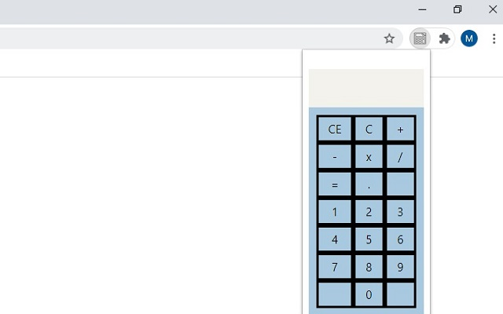

# Simple Calculator Firefox Addon

A lightweight calculator extension for Firefox that provides basic arithmetic operations.

## Installation

Get it from the Firefox Add-ons Store: [Super Simple Calculator](https://addons.mozilla.org/en-US/firefox/addon/super-simple-calculator-addon/)

## Features

- Basic arithmetic operations (+, -, x, /)
- Decimal point support 
- Keyboard input support
- Clear all (CE) and backspace (C) functions
- Clean, minimal interface
- Maximum 15 digit display

## Usage

- Click the calculator icon in your Firefox toolbar to open
- Enter numbers using mouse clicks or keyboard
- Supports keyboard shortcuts:
  - Enter/= to calculate
  - Delete to clear all
  - Backspace to delete last character
  - Standard operators (+, -, *, /)

## Development

This addon is built using:
- HTML/CSS for the interface
- Vanilla JavaScript for calculations
- Firefox WebExtensions API

## License

This project is released as open source software.

## Screenshot

